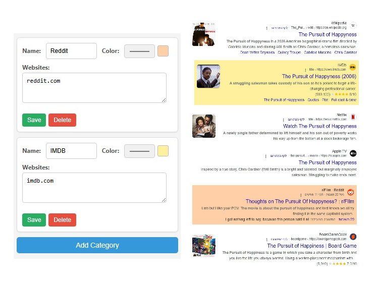

# Google Search Highlighter (Chrome Extension)

This Chrome extension enhances your Google search experience by allowing you to categorize search results directly on the page. The goal is to help users organize information, quickly identify relevant links from specific categories, and streamline the browsing process.

This extension is intended for anyone who frequently uses Google Search for a more efficient way to navigate information.

## Preview



## Technologies

*   **Languages:** JavaScript (ES6+), HTML5, CSS3
*   **APIs:** Chrome Extension APIs (Manifest V3)
*   **Storage:** `chrome.storage` API for local settings persistence.

## Installation

### From Source (for Developers)

If you want to run the extension from the source code (for development or testing):

1.  **Download the files:**
    * Download the files and extract them to a desired folder.

2.  **Load the extension in Chrome:**
    *   Open Chrome and navigate to `chrome://extensions`.
    *   Enable **"Developer mode"** (usually a toggle in the top-right corner).
    *   Click the **"Load unpacked"** button.
    *   Select the directory from your computer.

The extension should now appear in your list of extensions and be active.

## Usage

1.  After installation, the extension will automatically activate when you perform a search on Google.
2.  Click the extension's icon in the Chrome toolbar to access settings to configuring rules.
4.  Don't forget to save. 

## Support

The extension supports multiple versions of Google based on language and location. if your country's version doesn't appear you can create an issue to alert me or add it yourseld by using a pull request

These are the corrent URLs:

```
"*://*.google.com/search*",
"*://*.google.co.il/search*",
"*://*.google.co.uk/search*",
"*://*.google.ca/search*",
"*://*.google.com.au/search*",
"*://*.google.de/search*",
"*://*.google.fr/search*",
"*://*.google.es/search*",
"*://*.google.it/search*",
"*://*.google.co.jp/search*",
"*://*.google.ru/search*",
"*://*.google.com.br/search*",
"*://*.google.co.in/search*",
"*://*.google.cn/search*",
"*://*.google.com.mx/search*",
"*://*.google.nl/search*",
"*://*.google.se/search*",
"*://*.google.ch/search*",
"*://*.google.no/search*",
"*://*.google.dk/search*",
"*://*.google.fi/search*",
"*://*.google.pt/search*",
"*://*.google.pl/search*",
"*://*.google.com.tr/search*",
"*://*.google.ae/search*",
"*://*.google.com.sa/search*",
"*://*.google.com.eg/search*",
"*://*.google.com.ng/search*",
"*://*.google.co.za/search*",
"*://*.google.com.ar/search*",
"*://*.google.cl/search*"
```